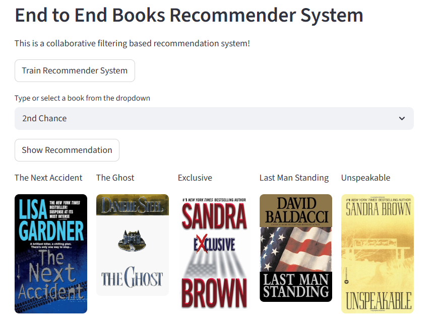

# Personalized-Book-Recommender-Using-ML

## Project Overview

This project is an end-to-end machine learning-based book recommendation system that suggests personalized books based on user preferences. It implements a complete MLOps pipeline, including data ingestion, validation, transformation, and model training. The system uses collaborative filtering techniques to generate recommendations and is deployed through an interactive Streamlit web application.

## Features

* Personalized book recommendations
* Machine learning based system
* End to end pipeline
* Streamlit web application
* Docker support for deployment
* AWS EC2 deployment ready


## 📂 Project Structure

```
├── config.yaml
├── books_recommender/
│   ├── components/
│   │   ├── stage_00_data_ingestion.py
│   │   ├── stage_01_data_validation.py
│   │   ├── stage_02_data_transformation.py
│   │   ├── stage_03_model_trainer.py
│   ├── pipeline/
│   │   └── training_pipeline.py
│   ├── config/
│   ├── entity/
│   ├── constant/
│   ├── logger/
│   ├── exception/
├── app.py
├── main.py
├── requirements.txt
├── Dockerfile
```

## Workflow

1. Configuration setup using config.yaml
2. Data processing and preparation
3. Model building using machine learning
4. Pipeline creation
5. Streamlit application integration
6. Deployment using Docker and AWS


## 🛠️Installation and Setup

### Step 1 Create Conda Environment

```
conda create -n books python=3.7.10 -y
conda activate books
```

### Step 2 Install Dependencies

```
pip install -r requirements.txt
```

### Step 3 Run the Application

```
streamlit run app.py
```

---

## 🐳Docker Deployment

### Step 1 Launch EC2 Instance

Login to AWS console and launch an EC2 instance. Make sure port 8501 is open.

---

### Step 2 Install Docker

```
sudo apt-get update -y
sudo apt-get upgrade -y

curl -fsSL https://get.docker.com -o get-docker.sh
sudo sh get-docker.sh

sudo usermod -aG docker ubuntu
newgrp docker

```

---

### Step 3 Clone Repository

```

git clone https://github.com/BijoyDewanjee/Personalized-Book-Recommender-Using-ML.git
ls

cd Personalized-Book-Recommender-Using-ML
ls
cat Dockerfile
```

---

### Step 4 Build Docker Image

```
docker build -t book-recommender:latest .
```

---

### Step 5 Run Docker Container

```
docker run -d -p 8501:8501 book-recommender
```

---

### Step 6 Check Running Containers

<pre class="overflow-visible! px-0!" data-start="2217" data-end="2238"><div class="relative w-full mt-4 mb-1"><div class=""><div class="relative"><div class="h-full min-h-0 min-w-0"><div class="h-full min-h-0 min-w-0"><div class="border border-token-border-light border-radius-3xl corner-superellipse/1.1 rounded-3xl"><div class="h-full w-full border-radius-3xl bg-token-bg-elevated-secondary corner-superellipse/1.1 overflow-clip rounded-3xl lxnfua_clipPathFallback"><div class="pointer-events-none absolute inset-x-4 top-12 bottom-4"><div class="pointer-events-none sticky z-40 shrink-0 z-1!"><div class="sticky bg-token-border-light"></div></div></div><div class="w-full overflow-x-hidden overflow-y-auto"><div class="relative z-0 flex max-w-full"><div id="code-block-viewer" dir="ltr" class="q9tKkq_viewer cm-editor z-10 light:cm-light dark:cm-light flex h-full w-full flex-col items-stretch ͼ5 ͼj"><div class="cm-scroller"><div class="cm-content q9tKkq_readonly"><span>docker </span><span class="ͼd">ps</span></div></div></div></div></div></div></div></div></div><div class=""><div class=""></div></div></div></div></div></pre>

---

### Step 7 Stop and Remove Container

```
docker stop <container_id>
docker rm <container_id>
```

---

## 🚀 Docker Hub Workflow

This section demonstrates how to push your Docker image to Docker Hub and run it from anywhere.

---

### 🔐 Step 1: Login to Docker Hub

```
docker login
```

---

### 🏷️ Step 2: Tag the Docker Image

```
docker tag book-recommender:latest bijoydewanjee/book-recommender:latest
```

---

### 📤 Step 3: Push Image to Docker Hub

```
docker push bijoydewanjee/book-recommender:latest
```

---

### 📥 Step 4: Pull Image from Docker Hub

```
docker pull bijoydewanjee/book-recommender:latest
```

---

### ▶️ Step 5: Run Container

```
docker run -d -p 8501:8501 bijoydewanjee/book-recommender:latest
```

---

### 🧹 Step 6: Remove Local Image (Optional)

```
docker rmi bijoydewanjee/book-recommender:latest
```

---

## 🌐 Access the Application

Open your browser and visit:

```
http://<your-ec2-public-ip>:8501

http://3.224.135.37:8501

```



## Technology Stack

* Python
* Machine Learning
* Pandas and NumPy
* Scikit learn
* Streamlit
* Docker
* AWS EC2

# Author

#### Bijoy Dewanjee

**GitHub**: [https://github.com/BijoyDewanjee](https://github.com/BijoyDewanjee)

---

## License

This project is licensed under the MIT License.
